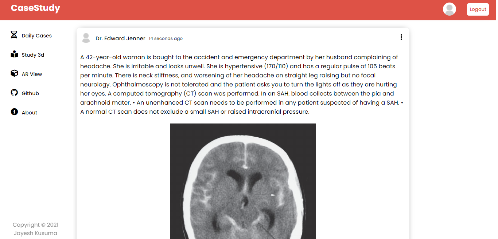
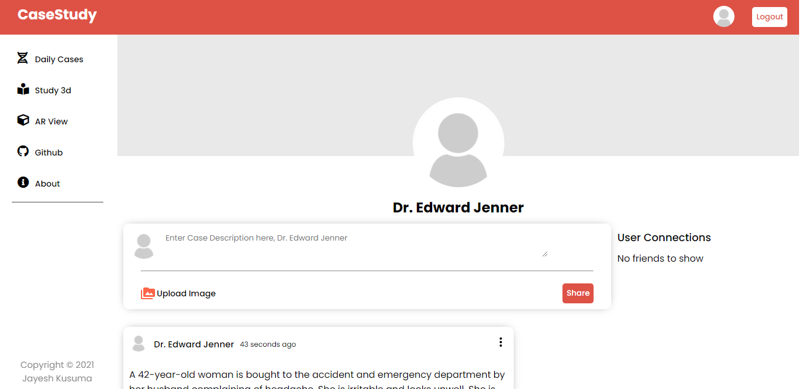
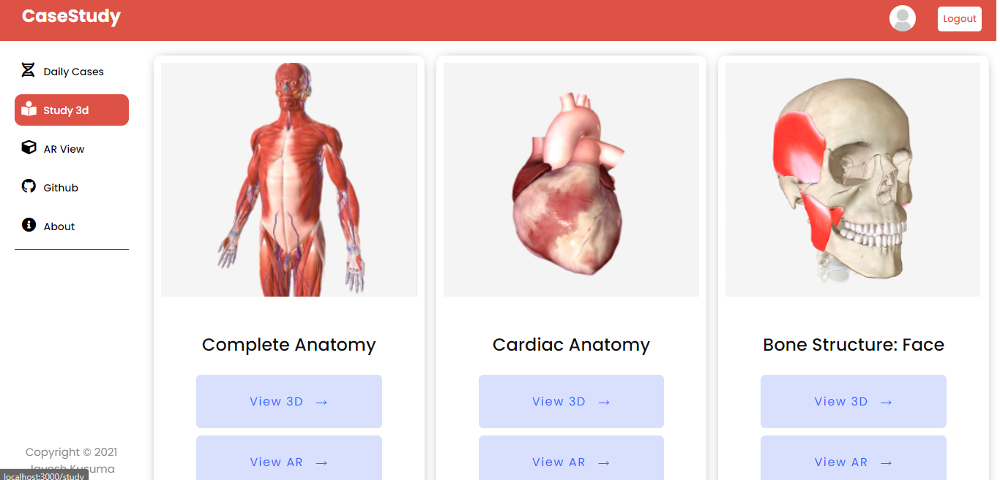
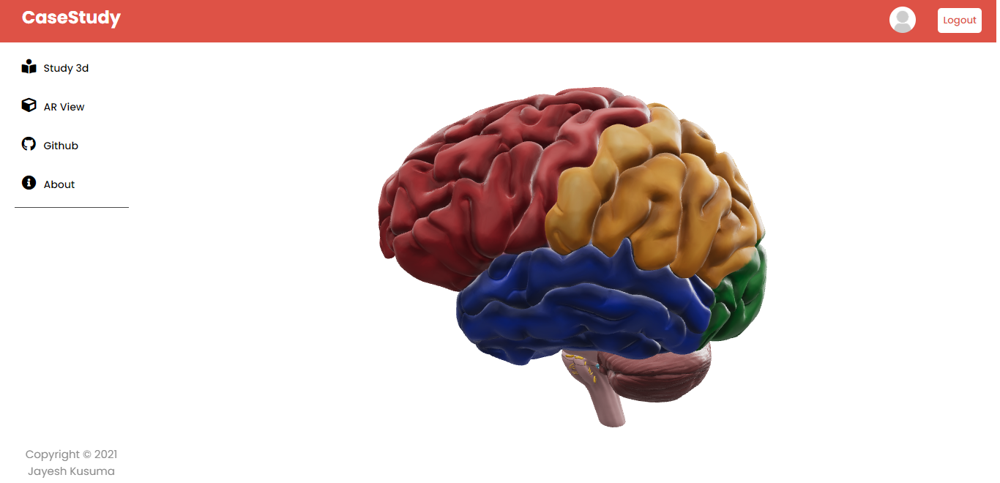
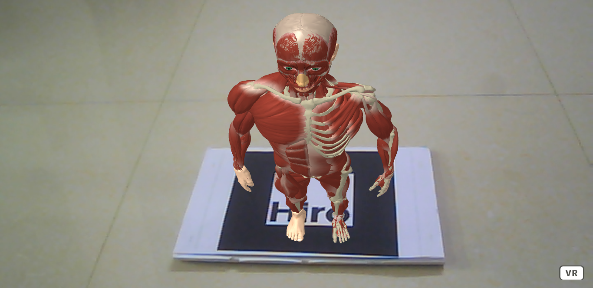
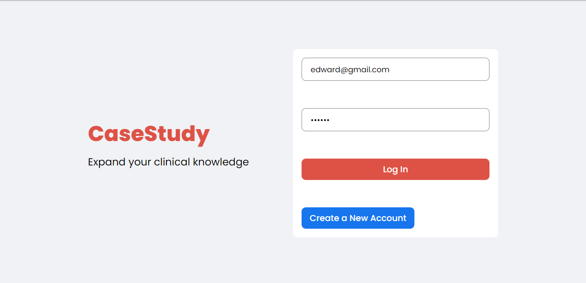
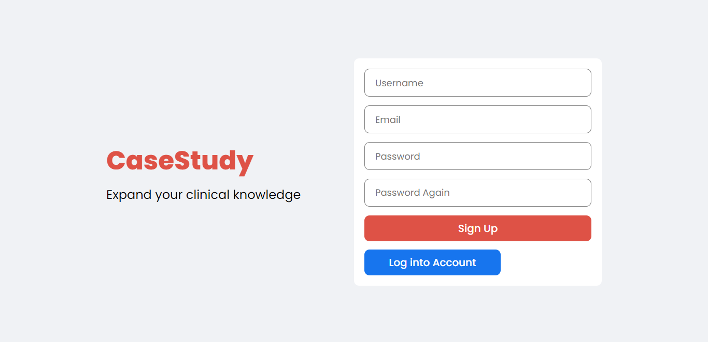

# "Case Study"  

Case Study is a social networking and medical education platform for medical students and healthcare professionals. It provides a platform for healthcare professionals to present interesting and rare medical cases with their connections. Students can learn from these real-world medical cases and develop their clinical knowledge. Users can also have a fun learning experience with interactive 3D models which also supports Augmented Reality.   

## Screenshots

Home Page


Profile Page


Study Models


3D view


AR view


Login Page


Register Page

  
## Tech Stack

**Client:** React.js, HTML, CSS. 

**Server:** Node, Express

**Database:** MongoDB


  
## Installation

Install npm dependencies

```bash
  cd api/
  npm install
  npm start
  cd..
  cd client/
  npm install
  npm start
```
    
